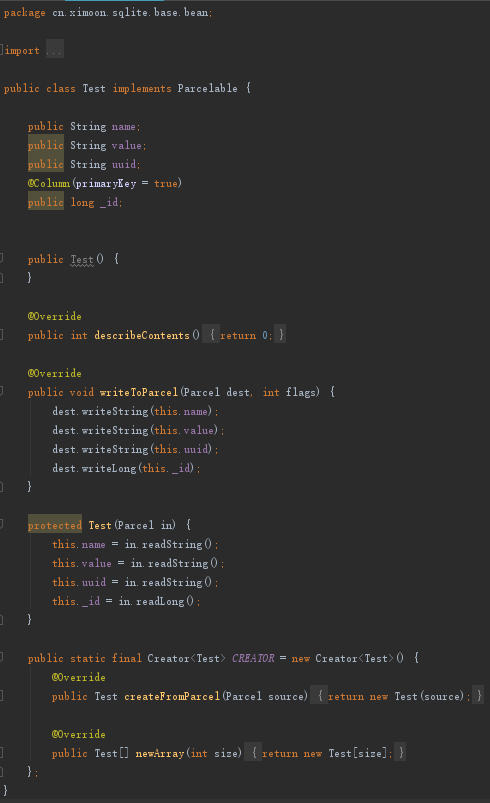

# 数据库代码自动生成器

有时候使用数据库框架来操作数据库数据对我们的App来讲并不一定十分适用，其实使用Google提供的`SQLiteOpenHelper`也十分直观，在数据库框架还没有流行的时候，我们的App也基本都是用的是这种方式对数据库的处理。

但有时候一个App里可能会存在N多张表，又懒的用框架写那么多注释构建再拷贝代码，但使用`SQLiteOpenHelper`同样也有大量的重复性代码，或者是同模式的代码。于是，根据自己所开发的App大部分功能来看，归纳了这几点数据库操作需求：

1. 创建表的语句
2. 基本的增删改查，其中删改查根据主键_id作为条件
3. 增删改查语句中，不可避免的Java对象和数据库数据的相互转换
4. Java实体类和数据库列名之间的对应关系（方便我们纠错排查）

基于这几点需求，我们初步定一下我们的实现方案：

1. 创建一个Java基本类
2. 根据基本类，构建数据模型（即创建一个新的Java类，用来存放相关的数据库操作方法）
3. 如果对类的某些字段有特殊需求，也可以进行特殊处理，因此需要添加注解，如主键，列名或者表名，唯一标识等等

---------------------------
## Step1. 构建注解

接下来第一步，我们需要创建自己的注解类型，分为两种注解类型，类注解和属性注解，分别对应数据库的表和列，在这里我们需要注意：

1. 是不是这个Bean的所有非`static`和`final`修饰的属性都需要创建到这张表中；
2. 这个Bean有没有主键列对应的属性；
3. 存不存在唯一约束；
4. 属性有没有指定的列名；
5. **如果不存在注解，即默认相关方案创建数据库相关转换规则。**

把这些需求反应到我们的注解当中：

表注解：

    /**
     * 表注解
     */
    @Retention(RetentionPolicy.RUNTIME)
    public @interface Table {
        /**
         * 设置表名
         */
        String name() default "";
        /**
         * 是否所有属性建表列
         * @return
         */
        boolean all() default false;
    }

属性注解：

    /**
     * 列注解
     */
    @Retention(RetentionPolicy.RUNTIME)
    public @interface Column {
        /**
         * 数据库列名
         * @return
         */
        String name() default "";
        /**
         * 是否主键
         * @return
         */Key() default false;
        /**
        boolean primary
         * 是否唯一约束
         * @return
         */
        boolean unique() default false;
    }

接下来的工作就是我们的核心，如果给定一个Bean类，首先要获取该Bean类的所有属性，且不能被修饰为`static`和`final`的属性，然后根据获取的属性集合转为表的列。

---------------------------

---------------------------
## Step2. 对Bean类进行反射提取

有了基本的注解，我们就可以增加我们的特殊需求了，当然没有注解，我们也有自己默认的处理方案。在这部分的处理当中，我们首先要做的是，一个Java类的基本属性对应到表的这个映射过程中，我们涉及到了两个命名规则：

1. 列名，也就是我们SQLite中Table的Column名称，可通过注解进行自定义，默认为属性名的驼峰转小写字母的下划线写法
2. 映射关系名称，也就是我们在Java程序中，涉及到列名使用，如增删改查所需的列名参数，当然需要抽取成一个个公共的String对象，固定是属性名的驼峰转大写字母的下划线写法

同时，我们的属性名和属性对应的SQLite类型以及是否主键的标志，我们将这些统一封装成Bean类的一个属性转SQLite-Table-Column的一个相关配置的实体信息,即一种映射关系：

    public class ColumnDetail {

        /**
         * 列名
         */
        private String columnName;
        /**
         * 属性名
         */
        private String fieldName;
        /**
         * 定义名称，可以用来被调用的列名、表名的引用对象（即columnName值的引用对象）
         */
        private String relativeName;
        /**
         * SQLite类型
         */
        private String type;
        /**
         * 是否主键
         */
        private boolean isPrimaryKey;

        public ColumnDetail(String columnName, String fieldName, String connectName, String type, boolean isPrimaryKey) {
            this.columnName = columnName;
            this.fieldName = fieldName;
            this.relativeName = connectName;
            this.type = type;
            this.isPrimaryKey = isPrimaryKey;
        }

        public String getRelativeName() {
            return relativeName;
        }

        public void setRelativeName(String relativeName) {
            this.relativeName = relativeName;
        }

        public String getFieldName() {
            return fieldName;
        }

        public void setFieldName(String fieldName) {
            this.fieldName = fieldName;
        }

        public String getColumnName() {
            return columnName;
        }

        public void setColumnName(String columnName) {
            this.columnName = columnName;
        }

        public String getType() {
            return type;
        }

        public void setType(String type) {
            this.type = type;
        }

        public boolean isPrimaryKey() {
            return isPrimaryKey;
        }

        public void setPrimaryKey(boolean primaryKey) {
            isPrimaryKey = primaryKey;
        }
    }

`eg: `       

| ColumnDetail属性 | 属性说明 | demo |
| ------ | ------ | ------ |
| fieldName|JAVA实体类的属性|mName| 
| columnName|SQLite的Table的Column|m_name| 
| relativeName|用来映射fieldName和columnName的关联关系名称 静态字符串常量 public static final String M_NAME = "m_name";|M_NAME| 
| type|SQLite的Table的Column的类型|TEXT| 

有了映射关系的准备之后，我们来解析我们的Bean类，注意，需要解析非`static`和`final`修饰的变量：

    /**
     * 获取属性和列的对应关系
     * 如果该属性指定了列名，则创建表时用指定列名，否则默认将属性名称的驼峰式写法转下划线写法
     * 引用类型采用属性名称的驼峰式转下划线的方式定义
     * 如果实体类中指定了主键，则引用属性和列名都用_id。
     * 如果没有指定主键，若属性中存在int或long类型的_id，默认为主键，否则创建一个名为_ID的属性和列
     * 只能指定一个主键，否则会使创建SQL语句出现问题
     * 注意，注解的primaryKey必须为long类型，否则生成的JAVA文件会有错
     * 目前支持的JAVA类型有int、long、float、double、String、byte，对应SQLite的INTEGER、TEXT、REAL
     * @param clazz 实体类
     * @return 对应关系集合
     * @throws Exception
     */
    private static List<ColumnDetail> getColumns(Class<?> clazz) throws Exception {
        List<ColumnDetail> colums = new ArrayList<>();
        List<Integer> unAssigned = new ArrayList<>();
        // 是否全部建列
        boolean isAll = true;
        // 是否存在指定非主键列
        boolean isColumn = false;
        // 是否存在指定注解@Table
        boolean isTable = false;
        boolean hasPrimaryKey = false;
        // 判断是否有@Table注解并标记isTable
        // 如果有则判断是否全部属性建列，如果没有@Table注解，则默认全部属性建列，并标记isAll
        if (clazz.isAnnotationPresent(Table.class)) {
            Table table = clazz.getAnnotation(Table.class);
            isTable = true;
            isAll = table.all();
        }
        Field[] fields = clazz.getDeclaredFields();
        if (fields != null) {
            for (Field field : fields) {
                // 排除掉静态变量和常量
                if (!Modifier.isStatic(field.getModifiers()) && !Modifier.isFinal(field.getModifiers())) {
                    // 如果使用@Column注解，则按照指定要求建列
                    if (field.isAnnotationPresent(Column.class)) {
                        String columnName;
                        Column column = field.getAnnotation(Column.class);
                        columnName = column.name();
                        boolean isPrimaryKey = false;
                        String type;
                        if (int.class.isAssignableFrom(field.getType()) || long.class.isAssignableFrom(field.getType())) {
                            // 主键
                            if (column.primaryKey()) {
                                columnName = "_id";
                                isPrimaryKey = true;
                                hasPrimaryKey = true;
                                type = "INTEGER PRIMARY KEY AUTOINCREMENT";
                            } else {
                                type = "INTEGER";
                            }
                        } else if (String.class.isAssignableFrom(field.getType())) {
                            type = "TEXT";
                        } else if (float.class.isAssignableFrom(field.getType()) || double.class.isAssignableFrom(field.getType())) {
                            type = "REAL";
                        } else if (byte.class.isAssignableFrom(field.getType())) {
                            type = "BLOB";
                        } else {
                            throw new Exception("TYPE ERROR:  " + field.getType() + "  :  " + field.getName());
                        }
                        // 如果指定列名为空，则默认驼峰转下划线方式命名
                        if (StringUtil.isEmpty(columnName)) {
                            columnName = StringUtil.humpToUnderline(field.getName()).toLowerCase();
                        }
                        // 存在非主键的指定列，并标记
                        if (!column.primaryKey()){
                            isColumn = true;
                        }
                        if (column.unique()){
                            type = type + " UNIQUE";
                        }
                        // 添加到集合中
                        colums.add(new ColumnDetail(columnName.toLowerCase(), field.getName(), StringUtil.humpToUnderline(field.getName()).toUpperCase(), type, isPrimaryKey));
                    } else if (isAll) {
                        // 非指定列
                        String columnName = StringUtil.humpToUnderline(field.getName()).toLowerCase();
                        boolean isPrimaryKey = false;
                        if (field.getName().equalsIgnoreCase("_ID")) {
                            isPrimaryKey = true;
                            hasPrimaryKey = true;
                        }
                        String type;
                        if (int.class.isAssignableFrom(field.getType()) || long.class.isAssignableFrom(field.getType())) {
                            if (isPrimaryKey) {
                                type = "INTEGER PRIMARY KEY AUTOINCREMENT";
                            } else {
                                type = "INTEGER";
                            }
                        } else if (String.class.isAssignableFrom(field.getType())) {
                            type = "TEXT";
                        } else if (float.class.isAssignableFrom(field.getType()) || double.class.isAssignableFrom(field.getType())) {
                            type = "REAL";
                        } else if (byte.class.isAssignableFrom(field.getType())) {
                            type = "BLOB";
                        } else {
                            throw new Exception("TYPE ERROR:  " + field.getType() + "  :  " + field.getName());
                        }
                        // 如果非主键列，则将集合的游标记录下，当确定除指定属性不建列时，从集合中移除
                        if (!isPrimaryKey){
                            unAssigned.add(unAssigned.size());
                        }
                        colums.add(new ColumnDetail(columnName, field.getName(), columnName.toUpperCase(), type, isPrimaryKey));
                    } else {
                        // 为防止自增主键列对应的属性_id被重复创建，在这里获取
                        if (field.getName().equalsIgnoreCase("_ID")) {
                            hasPrimaryKey = true;
                            colums.add(new ColumnDetail("_id", field.getName(), "_ID", "INTEGER PRIMARY KEY AUTOINCREMENT", true));
                        }
                    }
                }
            }
            // 当指定了@Table的all属性为true或者除主键列的属性有注解外没有任何注解的情况下，全部属性自建列，否则只有指定的属性和主键对应的属性建列
            if ((isTable && !isAll) || (!isTable && isColumn)){
                for (int i = 0; i < unAssigned.size(); i++) {
                    colums.remove(unAssigned.get(i) + i);
                }
            }
            // 如果类不存在指定的主键对应的属性时，创建_id的属性，并创建自增主键列，该条对应关系的属性名称为空，方便后续在实体类中增加该属性
            if (!hasPrimaryKey) {
                colums.add(new ColumnDetail("_id", "", "_ID","INTEGER PRIMARY KEY AUTOINCREMENT", true));
            }
        }
        return colums;
    }

除了解析列之外，还有表名需要获取：

    /**
     * 获取实体类的表名（如果没有用@Table注解，则创建表的sql语句中表名默认为类名小写）
     * @param clazz 实体类
     * @return 注解的表名（如果没有指定表名则返回null）
     */
    private static String getTableName(Class<?> clazz) {
        String name = null;
        if (clazz.isAnnotationPresent(Table.class)) {
            Table table = clazz.getAnnotation(Table.class);
            name = "tb_" + StringUtil.humpToUnderline(table.name()).toLowerCase();
        }
        return name;
    }

---------------------------

---------------------------
## Step3.表的创建

有了属性和列的对应关系，即`List<ColumnDetail>`，就可以动手先出相关的SQL语句了。不过我们需要先将表名和列名写成静态常量以供调用，如： `public static final String M_NAME = "m_name";`

    /**
     * 生成创建表的SQL语句和以_ID为查询条件的静态常量语句
     * 创建表的SQL语句的静态常量名为CREATE_TABLE
     * 创建以_ID为查询条件的静态常量名为_ID_CLAUSE
     * public static final String CREATE_TABLE = "CREATE TABLE " + TABLE_NAME + "(" + _ID + " INTEGER PRIMARY KEY AUTOINCREMENT, " + COLUMN + " TYPE)"；
     * CREATE_TABLE拼接语句的使用使用StringBuilder
     * public static final String _ID_CLAUSE = _ID + " = ?";
     * @param columns {@link #getColumns}
     * @return 创建表的SQL语句
     * @throws Exception
     */
    public static String createTable(List<ColumnDetail> columns) throws Exception {
        String sql = null;
        StringBuilder builder = new StringBuilder("\tpublic static final String CREATE_TABLE = new StringBuilder(\"CREATE TABLE \")").append(".append(TABLE_NAME).append(\"( \")");
        if (!columns.isEmpty()) {
            for (ColumnDetail column : columns) {
                builder.append("\n\t\t\t.append(").append(column.getRelativeName()).append(").append(\" ");
                if (column.isPrimaryKey()) {
                    builder.append(column.getType()).append(" , \")");
                } else {
                    builder.append(column.getType()).append(", \")");
                }
            }
            int start = builder.length() - ", \")".length();
            builder.replace(start, start + 2, ")");
            builder.append(".toString();\n");
            builder.append("\n\tpublic static final String _ID_CLAUSE = _ID + \" = ?\";\n");
            sql = builder.toString();
        }
        return sql;
    }

在这个过程中，为了我们方便后续改查删使用主键作为条件，我们同时将查询条件也写成静态常量方便调用： `public static final String _ID_CLAUSE = _ID + " = ?";`

接下来的工作也很简单了，将数据库数据和JAVA对象进行相互转化的语句构建：

JAVA对象转数据库类型的键值对`ContetnValues`获取:

    /**
     * 生成增删改的所需要用到的键值对方法语句
     * 主键默认自增，所以方法中不会包含将_ID设置到键值对的语句
     * 创建的方法名为 getKeyAndValue，方法参数为实体类对象info（非空）
     * 方法类型默认静态，方法返回键值对ContentValues
     * public static ContentValue getKeyAndValue(Object obj){
     *     ContentValue cv = new ContentValue();
     *     cv.put(RELATIVE_NAME, obj.field); 
     *     return cv;
     * }
     * @param clazz 实体类
     * @param columns {@link #getColumns}
     * @return 生成创建键值对的方法语句
     * @throws Exception
     */
    public static String createCV(Class<?> clazz, List<ColumnDetail> columns) throws Exception {
        StringBuilder builder = new StringBuilder("\tpublic static ContentValues getKeyAndValue(");
        builder.append(clazz.getSimpleName()).append(" info){\n").append("\t\tContentValues cv = new ContentValues();\n");
        for (ColumnDetail column : columns) {
            if (!StringUtil.isEmpty(column.getFieldName())) {
                // 对非主键列的所有属性值装载
                if (!column.isPrimaryKey()) {
                    builder.append("\t\tcv.put(").append(column.getRelativeName()).append(", info.").append(column.getFieldName()).append(");\n");
                }
            }
        }
        builder.append("\t\treturn cv;\n\t}\n");
        return builder.toString();
    }

数据库游标Cursor转Java类型的获取:

    /**
     * 生成读取表后转实体类的对应方法语句
     * 根据反射的字段类型判断需要获取的基本类型
     * 如果指定了主键或存在_id则用指定主键的属性名称，否则默认_id
     * 创建的方法名为 getModel，参数为实体类对象info（非空）和游标对象cr（Cursor），方法返回值为空，通过参数的引用赋值
     * public static void getModel(Object obj, Cursor cr){
     *     info.field = cr.getInt(cr.getColumnIndex(RELATIVE_NAME));     // int类型,RELATIVE_NAME替换称列的关联静态常量
     *     info.field = cr.getLong(cr.getColumnIndex(RELATIVE_NAME));    // long类型,RELATIVE_NAME替换称列的关联静态常量
     *     info.field = cr.getFloat(cr.getColumnIndex(RELATIVE_NAME));   // float类型,RELATIVE_NAME替换称列的关联静态常量
     *     info.field = cr.getDouble(cr.getColumnIndex(RELATIVE_NAME));  // double类型,RELATIVE_NAME替换称列的关联静态常量
     *     info.field = cr.getString(cr.getColumnIndex(RELATIVE_NAME));  // string类型,RELATIVE_NAME替换称列的关联静态常量
     *     info.field = cr.getBlob(cr.getColumnIndex(RELATIVE_NAME));    // blob类型,RELATIVE_NAME替换称列的关联静态常量
     *     info._id = cr.getLong(cr.getColumnIndex(_ID)); // 主键赋值
     * }
     * @param clazz 实体类
     * @param columns   {@link #getColumns}
     * @return  读取表后转实体类的对应方法语句
     * @throws Exception
     */
    public static String createModel(Class<?> clazz, List<ColumnDetail> columns) throws Exception {
        StringBuilder builder = new StringBuilder("\tpublic static void getModel(");
        builder.append(clazz.getSimpleName()).append(" info, Cursor cr){\n");
        if (columns != null) {
            for (ColumnDetail column : columns) {
                if (!StringUtil.isEmpty(column.getFieldName())) {
                    if (!column.isPrimaryKey()) {
                        builder.append("\t\tinfo.").append(column.getFieldName()).append(" = ");
                        Field field = clazz.getDeclaredField(column.getFieldName());
                        if (int.class.isAssignableFrom(field.getType())){
                            builder.append("cr.getInt(");
                        } else if(long.class.isAssignableFrom(field.getType())) {
                            builder.append("cr.getLong(");
                        } else if (String.class.isAssignableFrom(field.getType())) {
                            builder.append("cr.getString(");
                        } else if (float.class.isAssignableFrom(field.getType())) {
                            builder.append("cr.getFloat(");
                        } else if (double.class.isAssignableFrom(field.getType())) {
                            builder.append("cr.getDouble(");
                        } else if (byte.class.isAssignableFrom(field.getType())) {
                            builder.append("cr.getBlob(");
                        } else {
                            throw new Exception("TYPE ERROR:  " + field.getType() + "  :  " + field.getName());
                        }
                        builder.append("cr.getColumnIndex(").append(column.getRelativeName()).append("));\n");
                    } else {
                        builder.append("\t\tinfo.").append(column.getFieldName()).append(" = cr.getLong(cr.getColumnIndex(_ID));\n");
                    }
                } else {
                    // 如果不存在属性对应主键列，则用创建的属性_id获取主键值
                    builder.append("\t\tinfo._id = cr.getLong(cr.getColumnIndex(_ID));\n");
                }
            }
        }
        builder.append("\t}\n");
        return builder.toString();
    }

最后，我们可以构建我们的CRUD方法了：

    /**
     * 创建增删改查方法
     * insert, 单体插入返回行号或根据行号判定是否新增成功，集合插入，可根据需求自行修改，包括开启事务，中断插入等操作
     * update，包括参数primaryKey和obj对象，可自行修改参数为clazz对象的方法以满足需求，返回类型为int值，影响行数
     * delete，包括参数primaryKey和obj对象，可自行修改参数为clazz对象的方法以满足需求，返回类型为int值，影响行数
     * query, 包括查询全部（无参查询，集合输出）和按primaryKey查询单体、obj对象查询单体和集合，可修改obj对象查询方式以自定义满足需求
     * @param clazz
     * @param details
     * @param dbObj
     * @return
     */
    public static String createCRUD(Class<?> clazz, List<ColumnDetail> details, String dbObj){
        String primaryField = "_id";
        for (ColumnDetail detail : details) {
            if (detail.isPrimaryKey()){
                primaryField = detail.getFieldName();
                if (null != primaryField && primaryField.isEmpty()){
                    primaryField = "_id";
                }
                break;
            }
        }
        String clazzName = clazz.getSimpleName();
        StringBuilder builder = new StringBuilder("\t");
        // insert, 单体插入返回行号或根据行号判定是否新增成功，集合插入，可根据需求自行修改，包括开启事务，中断插入等操作
        // 返回long类型，插入的行号，主键自增，因此行号=主键
        builder.append("public static long insert(").append(clazzName).append(" info){\n\t\t")
                .append("SQLiteDatabase db = ").append(dbObj).append(";\n\t\t")
                .append("info.").append(primaryField).append(" = db.insert(TABLE_NAME, null, getKeyAndValue(info));\n\t\t")
                .append("return info.").append(primaryField).append(";\n\t}\n\n\t");
        // 返回布尔类型是否插入成功
        builder.append("public static boolean insertRow(").append(clazzName).append(" info){\n\t\t")
                .append("return insert(info) > 0;\n\t}\n\n\t");
        // 集合插入
        builder.append("public static boolean insertRow(List<").append(clazzName).append("> infos){\n\t\t")
                .append("boolean isInsert = false;\n\t\t")
                .append("for(").append(clazzName).append(" info : infos){\n\t\t\t")
                .append("isInsert &= insertRow(info);\n\t\t}\n\t\t")
                .append("return isInsert;\n\t}\n\n\t");
        // update，参数obj对象，返回类型为int值，影响行数, 可自行添加方法以满足需求
        // obj对象
        builder.append("public static int update(").append(clazzName).append(" info){\n\t\t")
                .append("SQLiteDatabase db = ").append(dbObj).append(";\n\t\t")
                .append("return db.update(TABLE_NAME, getKeyAndValue(info), _ID_CLAUSE, new String[]{String.valueOf(info.")
                .append(primaryField).append(")});\n\t}\n\n\t");
        // delete，包括参数primaryKey和obj对象，可自行修改参数为clazz对象的方法以满足需求，返回类型为int值，影响行数
        // primaryKey
        builder.append("public static int delete(long _id){\n\t\t")
                .append("SQLiteDatabase db = ").append(dbObj).append(";\n\t\t")
                .append("return db.delete(TABLE_NAME, _ID_CLAUSE, new String[]{String.valueOf(_id)});\n\t}\n\n\t");
        // obj对象
        builder.append("public static int delete(").append(clazzName).append(" info){\n\t\t")
                .append("SQLiteDatabase db = ").append(dbObj).append(";\n\t\t")
                .append("return db.delete(TABLE_NAME, _ID_CLAUSE, new String[]{String.valueOf(info.")
                .append(primaryField).append(")});\n\t}\n\n\t");
        // query, 包括查询全部（无参查询，集合输出）和按primaryKey查询单体、obj对象查询单体和集合，可修改obj对象查询方式以自定义满足需求
        // 无参数，查询全部
        builder.append("public static List<").append(clazzName).append("> queryAll(){\n\t\t")
                .append("ArrayList<").append(clazzName).append("> infos = new ArrayList<>();\n\t\t")
                .append("SQLiteDatabase db = ").append(dbObj).append(";\n\t\t")
                .append("Cursor cr = db.query(TABLE_NAME, null, null, null, null, null, null);\n\t\t")
                .append(clazzName).append(" info;\n\t\t")
                .append("while (cr.moveToNext()){\n\t\t\t")
                .append("info = new ").append(clazzName).append("();\n\t\t\t")
                .append("getModel(info, cr);\n\t\t\t")
                .append("infos.add(info);\n\t\t}\n\t\treturn infos;\n\t}\n\n\t");
        // 参数primaryKey，查询单条
        builder.append("public static ").append(clazzName).append(" query(long _id){\n\t\t")
                .append("SQLiteDatabase db = ").append(dbObj).append(";\n\t\t")
                .append("Cursor cr = db.query(TABLE_NAME, null, _ID_CLAUSE, new String[]{String.valueOf(_id)}, null, null, null);\n\t\t")
                .append(clazzName).append(" info = new ").append(clazzName).append("();\n\t\t")
                .append("if (cr.moveToNext()){\n\t\t\t")
                .append("getModel(info, cr);\n\t\t}\n\t\t")
                .append("return info;\n\t}\n\n\t");
        // 参数obj,查询单条
        builder.append("public static ").append(clazzName).append(" query(").append(clazzName).append(" info){\n\t\t")
                .append("SQLiteDatabase db = ").append(dbObj).append(";\n\t\t")
                .append("Cursor cr = db.query(TABLE_NAME, null, _ID_CLAUSE, new String[]{String.valueOf(info.").append(primaryField).append(")}, null, null, null);\n\t\t")
                .append(clazzName).append(" data = new ").append(clazzName).append("();\n\t\t")
                .append("if (cr.moveToNext()){\n\t\t\t")
                .append("getModel(data, cr);\n\t\t}\n\t\t")
                .append("return data;\n\t}\n\n\t");
        // 参数obj,查询列表
        builder.append("public static List<").append(clazzName).append("> queryAll(").append(clazzName).append(" info){\n\t\t")
                .append("ArrayList<").append(clazzName).append("> infos = new ArrayList<>();\n\t\t")
                .append("SQLiteDatabase db = ").append(dbObj).append(";\n\t\t")
                .append("Cursor cr = db.query(TABLE_NAME, null, _ID_CLAUSE, new String[]{String.valueOf(info.").append(primaryField).append(")}, null, null, null);\n\t\t")
                .append(clazzName).append(" data;\n\t\t")
                .append("while (cr.moveToNext()){\n\t\t\t")
                .append("data = new ").append(clazzName).append("();\n\t\t\t")
                .append("getModel(data, cr);\n\t\t\t")
                .append("infos.add(data);\n\t\t}\n\t\treturn infos;\n\t}\n");
        return builder.toString();
    }

新建一个Model类，将上述方法构建出来的内容输出到这个类中，就完成了我们的基本类似模块的快速构建。

---------------------------

---------------------------
## Step4.Bean文件的反写

写到这里，其实大部分的工作已经完成了，当然还有些小细节的内容需要我们灵活处置，在这里补充一个内容，就是Bean文件的反写？
为什么反写？
其实原因很简单，当很久之后翻过我们的代码看，我们需要很耐心的去一一比对我们的哪些属性需要构建为表的列，对应的列名又是什么，尤其在查看数据库又发现大量列的时候（SQLite是一个轻量级的数据库，因此当数据很多的时候，我们也一般很少用到表关联去分割我们的数据），这时候把我们自定义的注解再反写到Bean上会起到一个注释的作用。
这里我们采用了正则匹配查询的模式，一行一行的判定是不是我们的属性定义所在的行（当然也会有很多突发的小情况，比如说这个类并非要给裸类，而是存在很多注释或者不规则的情况，那么反写的代码也会存在一定的问题），如果是，切该属性行没有匹配到注解，那么在这个属性行的上面添加上我们的注解，如果匹配到对应的注解，则替换为更规范的注解方式。

    /**
     * 将构建的表名列名替换掉实体类的注解值
     * 如果存在类的注解@Table，将类的注解@Table的name值替换称model类对应的常量
     * 如果存在属性的注解@Column，将属性的注解@Column的name值替换称model类对应的常量
     * 如果不存在表注解@Table，则将表名的注解添加上，name值为model类对应的常量
     * 如果不存在属性注解@Column，则将表对应的列的注解添加上，name值model类对应的常量
     * 使用正则表达式的匹配查询的方式对每一行进行判断，如果该行存在指定的属性，则进行替换
     * 行的结束标志是;
     * 注意行内不要有注释
     * 针对主键做特殊处理
     * 引入相应的包
     * 处理结果
     * @Table(name = modelClass.TABLE_NAME)         // 是否全部建列属性即 @Table(all = true) 或 @Table(all = true) 则会被删除掉，可自行添加作为标记
     * public class Object {
     *     @Column(name = modelClass.RELATIVE_NAME)
     *     public String field;
     *     @Column(name = modelClass._ID, primaryKey = true)
     *     public long _id;
     * }
     * 正则表达式的用法：
     * [\s\S]   匹配任意字符(\s为空白字符，\S为非空白字符)
     * .        匹配非换行之外的字符(\n\r)
     * \t       缩进符
     * *        匹配0-任意次
     * +        匹配1-任意次（至少匹配一次）
     * ?        匹配0或1次（至多匹配一次）
     * []       字符集合，包含包含的任意一个字符的内容。对某些特殊符号进行匹配时，也需要用[]包住
     * [^]      字符集合，匹配未包含任意一个字符集的内容
     * \b       匹配左右边界，即边界存在空白字符即可匹配，在左匹配做边界，在右匹配右边界
     * $        匹配行尾
     * ^        匹配行首
     * JAVA中String.replace(String target, String replacement)和String.replaceAll(String regex, String replacement)的区别
     * replace查找target的内容，并替换成指定内容replacement
     * replaceAll通过正则匹配查找内容，并替换成指定内容replacement
     * @param clazz 实体类
     * @param modelClazz    生成对应常量名称和SQL语句、映射方法的model类
     * @param filename  实体类的路径
     * @param columns   {@link #getColumns}
     * @return  修改后的实体类
     * @throws Exception
     */
    public static String writeReflect(Class<?> clazz, Class<?> modelClazz, String filename, List<ColumnDetail> columns) throws Exception {
        StringBuilder builder = new StringBuilder();
        File file = new File(filename);
        FileReader reader = new FileReader(file);
        BufferedReader br = new BufferedReader(reader);
        String line;
        while ((line = br.readLine()) != null) {
            builder.append(line).append("\n");
        }
        br.close();
        reader.close();
        Field[] fields = clazz.getDeclaredFields();
        String content = builder.toString();
        if (fields != null) {
            boolean isNeedPrimaryKey = false;
            for (ColumnDetail column : columns) {
                if (!StringUtil.isEmpty(column.getFieldName())) {
                    Field field = clazz.getDeclaredField(column.getFieldName());
                    // 匹配查询，查询@Column...public/private/protected/default javaType fieldName;(目前只支持public模式，方便赋值)
                    String regexAnnotation = "(\\t*)( *)(((@Column( *\\t*[(] *[^)]*[)] *\\t*))|((@Column *\\t*)))|())";
                    String regexDeclare = Modifier.isPrivate(field.getModifiers()) ? "private" : Modifier.isPublic(field.getModifiers()) ? "public" : Modifier.isProtected(field.getModifiers()) ? "protect" : "";
                    String regexType = field.getType().getSimpleName();
                    String regexName = field.getName();
                    String regex = regexAnnotation + "\\s*" + regexDeclare + "\\s*" + regexType + "\\s*" + regexName + "\\s*;" + "\\t* *";
                    StringBuilder newLine = new StringBuilder("\n");
                    builder.append("\t");
                    if (column.isPrimaryKey()) {
                        newLine.append("\n\t@Column(name = ").append(modelClazz.getSimpleName()).append("._ID, primaryKey = true)");
                    } else {
                        newLine.append("\t@Column(name = ").append(modelClazz.getSimpleName()).append(".").append(column.getRelativeName()).append(")");
                    }
                    newLine.append("\n\t");
                    newLine.append("" == regexDeclare ? "" : regexDeclare + " ").append(regexType).append(" ").append(regexName).append(";");
                    content = content.replaceAll(regex, newLine.toString());
                } else {
                    isNeedPrimaryKey = true;
                }
            }
            Pattern pattern = Pattern.compile("((((@Table)[\\s\\S]*)|())public\\s*class\\s*" + clazz.getSimpleName() + ")((\\s*[{])|( +[^{]*[{]))");
            Matcher m = pattern.matcher(content);
            if (m.find()) {
                String result = m.group();
                pattern = Pattern.compile("@Table\\s*([\\(]+[^)]*[\\)]+)*");
                m = pattern.matcher(result);
                String tableResult = result;
                if (m.find()){
                    tableResult = result.replace(m.group(), "");
                }
                String replaceContent = "import " + modelClazz.getName() + ";\nimport cn.ximoon.framework.db.Column;\n" + "import cn.ximoon.framework.db.Table;\n\n@Table(name = " + modelClazz.getSimpleName() + ".TABLE_NAME)\n" + tableResult + "\n";
                if (isNeedPrimaryKey){
                    replaceContent = replaceContent + "\n\n\t@Column(name = " + modelClazz.getSimpleName() + "._ID, primaryKey = true)\n\tpublic long _id;\n";
                }
                content = content.replace(result, replaceContent);
            }
            System.out.println(content);
        }
        return content;
    }

---------------------------

---------------------------
## Step5.工具的调用

接下来我们将所有完成的方法进行组合，并修改Bean类完成注解的替换和覆写Model类完成数据库的基础操作，同时如果有需要导包的地方也可以手动导入package，进一步减少我们的工作。
在这里需要注意，我们**定义了五个参数**，涉及到**两个类**，Bean和Model，以及这两个类的实际文件路径，路径的获取方式通过工程目录结构右键类文件，选择`Copy Path`，快捷键`Ctrl+Shift+C`即可，最后一个的参数是整个工程数据库持久化引擎的获取方式，通过继承`SQLiteOpenHelper`，并调用单例模式，获取`SQLiteDatabase`。

    /**
     * 生成实体类的基本SQL语句，包括表的创建SQL和表查询结果和实体类的相互转化方法以及表名列名的属性常量
     * 对实体类做基本替换
     * 注意modelClass覆写模式，即内容全部被替换成新内容，CRUD需要导入SQLiteDatabase的对象需要的类，创建完后可手动导入
     * 目前对属性只支持public，如果为其他修饰符(private、protected、default)，在赋值和取值对时候可能存在问题，同包可能不存在问题，私有化请自行更改代码
     * 即 info.field = ""; 和 info.setField("");
     * @param clazz 实体类
     * @param modelClazz    生成对应常量名称和SQL语句、映射方法的model类
     * @param beanName  实体类的路径
     * @param modelName model类的路径
     * @param dbobj    如果需要创建CRUD方法，则必须传入SQLiteDatabase获取的方法，以文本的方式传入
     *              eg: DBOpenHelp.getInstance().getSQLiteDatabase();
     *              生成 SQLiteDatabase db = DBOpenHelp.getInstance().getSQLiteDatabase();
     *              用来增删改查
     *  er@throws Exception
     */
    public static void writeFile(Class<?> clazz, Class<?> modelClazz, String beanName, String modelName, String dbobj) throws Exception {
        List<ColumnDetail> columns = getColumns(clazz);
        if (null != columns && columns.size() > 0) {
            String dbColumns = createDBColumns(clazz, columns);
            String createTable = createTable(columns);
            String createCV = createCV(clazz, columns);
            String createModel = createModel(clazz, columns);
            String createCRUD = "";
            if (!StringUtil.isEmpty(dbobj)) {
                createCRUD = "\n" + createCRUD(clazz, columns, dbobj) + "\n";
            }
            // 对modelClass覆写，并导入所需要对包
            StringBuilder builder = new StringBuilder("")
                    .append(modelClazz.getPackage())
                    .append(";\n\nimport android.content.ContentValues;\n")
                    .append("import android.database.Cursor;\n")
                    .append("import android.database.sqlite.SQLiteDatabase;\n")
                    .append("import android.text.TextUtils;\n\n")
                    .append("import java.util.ArrayList;\n")
                    .append("import java.util.List;\n")
                    .append("\nimport ")
                    .append(clazz.getPackage().getName())
                    .append(".")
                    .append(clazz.getSimpleName())
                    .append(";\n")
                    .append("\npublic class ")
                    .append(modelClazz.getSimpleName())
                    .append(" {\n\n")
                    .append(dbColumns)
                    .append("\n")
                    .append(createTable)
                    .append("\n")
                    .append(createCRUD)
                    .append(createCV)
                    .append("\n")
                    .append(createModel)
                    .append("\n}");
            String content = writeReflect(clazz, modelClazz, beanName, columns);
            FileWriter fileWriter = new FileWriter(beanName);
            fileWriter.write(content);
            fileWriter.flush();
            fileWriter.close();
            content = builder.toString();
            System.out.println(content);
            fileWriter = new FileWriter(modelName);
            fileWriter.write(content);
            fileWriter.flush();
            fileWriter.close();
        }
    }

---------------------------

附上效果图：

执行前：

 

执行后：

 

导包后：

